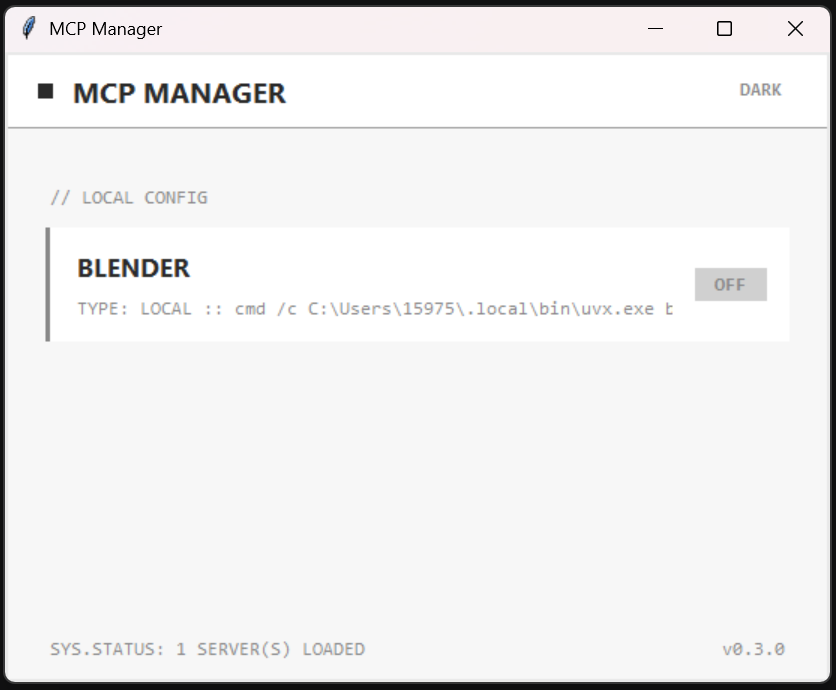
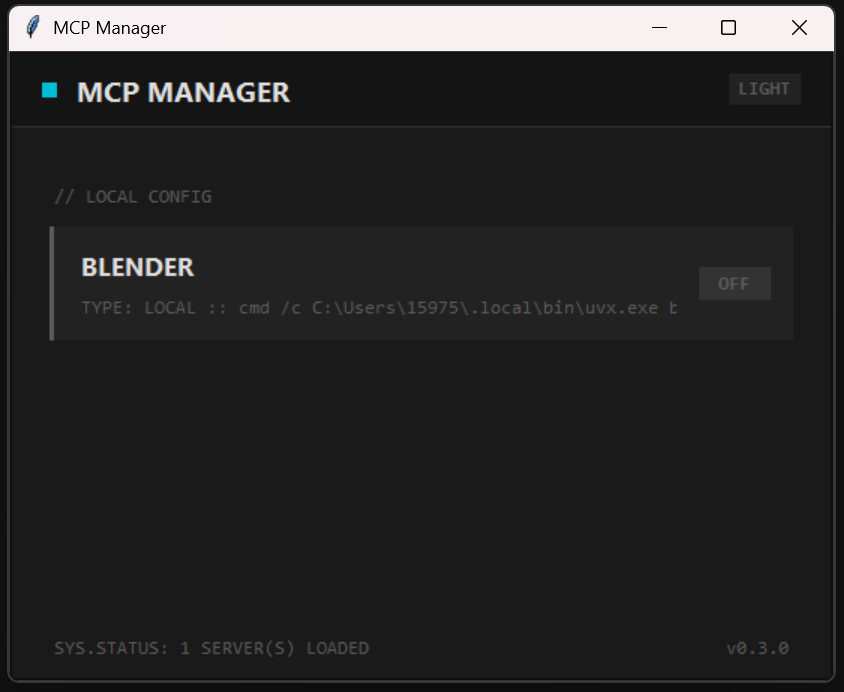

# OpenCode MCP Manager

Simple GUI tool to manage MCP (Model Context Protocol) servers for [OpenCode](https://opencode.ai).

Toggle your MCP servers ON/OFF without manually editing JSON files.

## Features

- **Toggle MCP servers** — Enable/disable with one click
- **Dual config support** — Works with both global (`~/.config/opencode/`) and local (`./opencode.json`) configs
- **Auto-refresh** — Detects external config changes automatically
- **Command preview** — Shows the command used to run each MCP server
- **Light/Dark theme** — Switch between themes with one click

## Screenshots

| Light Theme | Dark Theme |
|-------------|------------|
|  |  |

## Installation

### Option 1: Download .exe (Windows)

1. Download `MCP_Manager.exe` from [Releases](https://github.com/NyanDanKun/opencode-mcp-manager/releases)
2. Run from any directory with `opencode.json` or it will check global config

### Option 2: Run from source

```bash
git clone https://github.com/NyanDanKun/opencode-mcp-manager.git
cd opencode-mcp-manager
python mcp_manager.py
```

### Build .exe yourself

```bash
pip install pyinstaller
pyinstaller --onefile --windowed --name "MCP_Manager" mcp_manager.py
```

## How it works

OpenCode uses `opencode.json` config files to define MCP servers:

```json
{
  "$schema": "https://opencode.ai/config.json",
  "mcp": {
    "blender": {
      "type": "local",
      "command": ["uvx", "blender-mcp"],
      "enabled": true
    }
  }
}
```

This tool provides a GUI to toggle `"enabled": true/false` without editing JSON manually.

### Config locations

| Type | Path | Priority |
|------|------|----------|
| Global | `~/.config/opencode/opencode.json` | User-wide settings |
| Local | `./opencode.json` | Project-specific (overrides global) |

## Requirements

- Python 3.8+ (for running from source)
- Windows 10/11 (for .exe)
- tkinter (included with Python)

## License

MIT License - see [LICENSE](LICENSE)

## Roadmap

- [ ] Add new MCP servers via GUI
- [ ] Built-in MCP catalog (popular servers)
- [ ] Rewrite in Rust (cross-platform, no dependencies)
- [ ] System tray mode
- [ ] Linux/macOS support

## Author

Created by [NyanDanKun](https://github.com/NyanDanKun)
